# STRONG FIGHTER

プレイ動画
### 作成者
> 河原電子ビジネス専門学校 ゲームクリエイター科 
> 1年 谷本優樹

## 目次
>   - [1.作品概要](#1作品概要)
>   - [2.操作方法](#2操作方法)
>   - [3.ソースコード](#3ソースコード)
>   - [4.モード選択と〇側選択操作](#4モード選択と〇側選択操作)
>   - [技術紹介](#技術紹介)
>     - [5.自動振り向き](#5自動振り向き)
>     - [6.ステップ](#6ステップ)
>     - [7.敵CPU](#7敵cpu)
>     - [8.カメラ](#8カメラ)
>     - [9.制限時間のUI](#9制限時間のui)
>     - [10.KO時の演出](#10ko時の演出)
  
## 1.作品概要
> * ゲームジャンル
>   * 対戦型格闘ゲーム
> * プレイ人数
>   * 1～2人
> * 対応コントローラー
>   * Xbox 360 コントローラー
> * ゲーム内容
>   * 制限時間内に立ち回りを駆使しながら体力を減らすゲーム
> * ルール
>    * 制限時間: 99秒
>    * ラウンド数: 3
>    * 体力: 100
>    * 攻撃の種類は4種類(地上攻撃2種類、空中攻撃2種類)
> * 地上攻撃
>    * パンチ
>      * ダメージ: 5
>      * リーチ: 短
>      * 後隙: 短
>      * 発生: 短 
>    * キック
>      * ダメージ: 10
>      * リーチ: 長
>      * 後隙: 長
>      * 発生: 遅
> * 空中攻撃
>    * パンチ
>      * ダメージ: 5
>      * リーチ: 短
>      * 後隙: 長
>      * 発生: 短
>    * キック
>      * ダメージ: 5
>      * リーチ: 長
>      * 後隙: 長
>      * 発生: 短
> * ラウンド取得
>   * どちらかの体力が0になったら体力が残っている側がラウンドを取得できる
>   * 制限時間が過ぎたら体力が多い側がラウンドを取得できる
>   * お互いの体力が同時に0になったら引き分けになりお互いにラウンドを取得する
>   * 制限時間が過ぎてお互いの体力が同じの場合は引き分けとして扱いお互いにラウンドを取得する
> * 勝敗
>   * 先に2ラウンド先取したら勝利
>   * お互いに2ラウンド先取した場合は引き分けになる
> * 使用ツール
>   * Visual Studio 2022
>   * 3ds Max 2025
>   * Adobe Photoshop 2024
> * 使用言語
>   * C++
> * 開発環境
>   * Windows11
>   * 学校内製ゲームエンジン(DirectX12)
> * 開発期間
>   * 2024年9月~2025年1月
> * 制作人数
>   * 1人
>
>  
> 
> [目次へ戻る](#目次)

## 2.操作方法
> 
> 移動: 左スティックの左右
>   
> 
> ステップ: 左スティックの左右のどちらかを素早く2回倒す
> 
> 
> ジャンプ: 左スティックを上に倒す
> 
> 
> パンチ: Aボタン
> 
> 
> キック: Bボタン
> 
> 
> 空中パンチ: ジャンプ中にAボタン
> 
> 
> 空中キック: ジャンプ中にBボタン
> 
> 
> 
> 
> 上段ガード: 対応攻撃 ***パンチ***・***空中パンチ***・***空中キック***
> * プレイヤーが左側にいる場合は左スティックを左に倒す
> 
> 
> 下段ガード: 対応攻撃 ***キック***
>   * プレイヤーが左側にいる場合は左スティックを左下に倒す
>
>  
> 
> [目次へ戻る](#目次)

## 3.ソースコード

作成したソースコード

> * BackGround.cpp
>   * BackGround.h
> * Debug.cpp
>   * Debug.h
> * Enemy.cpp
>   * Enemy.h
> * Fade.cpp
>   * Fade.h
> * Frame.cpp
>   * Frame.h
> * Game.cpp
>   * Game.h
> * GameCamera.cpp
>   * GameCamera.h
> * GameTimer.cpp
>   * GameTimer.h
> * HP.cpp
>   * HP.h
> * Player.cpp
>   * Player.h
> * Player2.cpp
>   * Player2.h
> * Result.cpp
>   * Result.h
> * Round.cpp
>   * Round.h
> * Title.cpp
>   * Title.h

 

[目次へ戻る](#目次)

## 4.モード選択と〇側選択操作
> 
> (図4.1) モード選択画面 
>  
> このゲームは2人対戦ができるのでモード選択する必要があります。(図4.1) 
> モード選択を選択したら次に〇側選択をします 
> 
> (図4.2) 1P VS CPUを選択したときの画面 
>  
> 
> 
> (図4.3) 1P VS 2Pを選択したときの画面 
>  
> 
> 〇側選択はラウンド開始時の初期位置を選択します。(図4.2) (図4.3) 
> 
> (図4.4) LEFTを選択した場合 
>  
> 
> 
> (図4.5) RIGHTを選択した場合 
> 
> [目次へ戻る](#目次)

# 技術紹介
## 5.自動振り向き
> 
> プレイヤーと敵またはプレイヤー2のポジション(x軸)の値を使いif文を使用することで自動で方向を変えることができます。 
> 
> 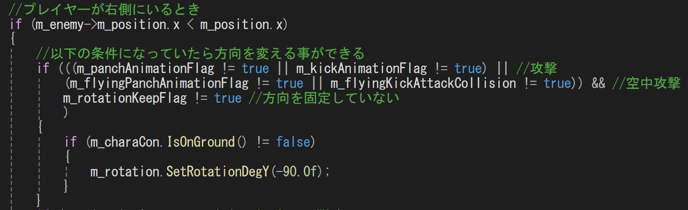
> (図5.1) プレイヤーが左方向を向くコード 
>  
> プレイヤーのポジションの値(x軸)が敵またはプレイヤー2のポジションの値(x軸)より大きかったら 
> プレイヤーは左方向を向きます。(図5.1)
>  
> 
> 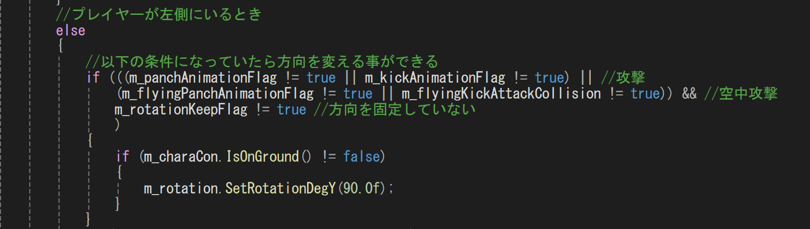
> (図5.2) プレイヤーが右を向くコード 
>  
> プレイヤーのポジションの値(x軸)が敵またはプレイヤー2のポジションの値(x軸)より小さかったら 
> プレイヤーは右方向を向きます。(図5.2)
>  
> 
> 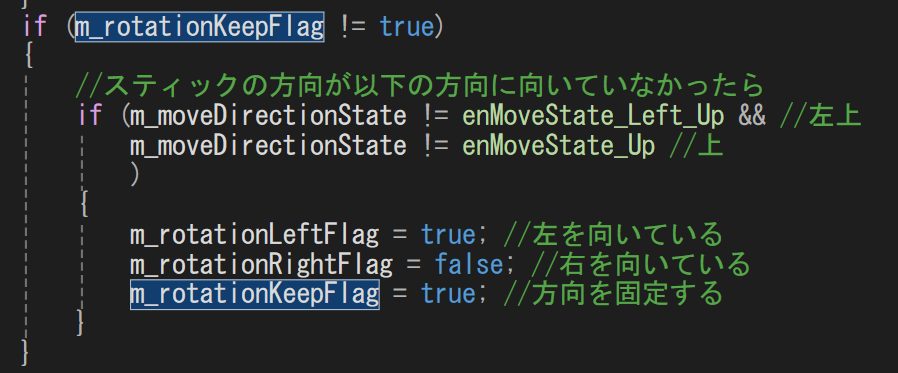 
> (図5.3) ジャンプしたときに方向を固定するコード 
>  
> 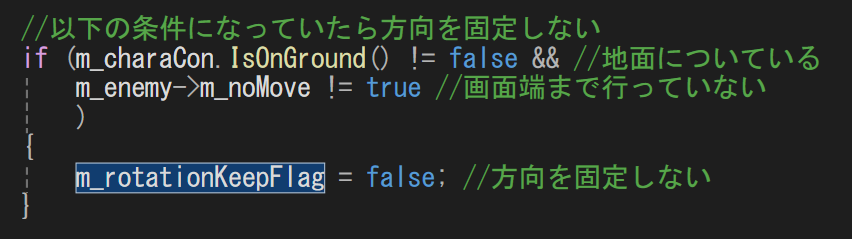 
> (図5.4) 方向を固定しないコード 
>  
> ジャンプしているときは方向を変えずに今向いている方向を向くようにする。(図5.3) 
> 
> [目次へ戻る](#目次)
> 
> ## 6.ステップ
> 右ステップを例に説明すると 
> 
> 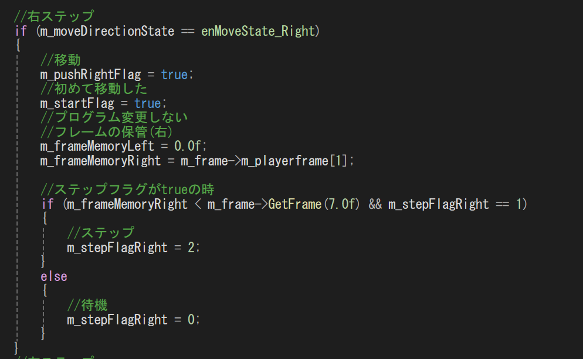 
> (図6.1) 右ステップする前のコード 
>  
> 最初の左スティックを右に倒したときのコードは 
> 右に倒したどうかのフラグが立ったり、 
> どのくらい左スティックを右に倒しているかのフレームを計測してそのフレームを保管用変数に代入しています。(図6.1) 
>  
> 
> 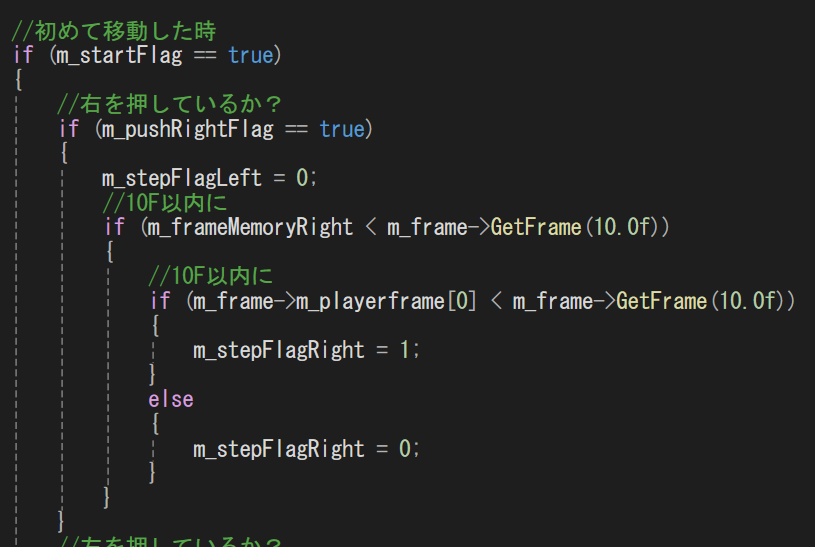 
> (図6.2) 左スティックを離したときのコード 
>  
> 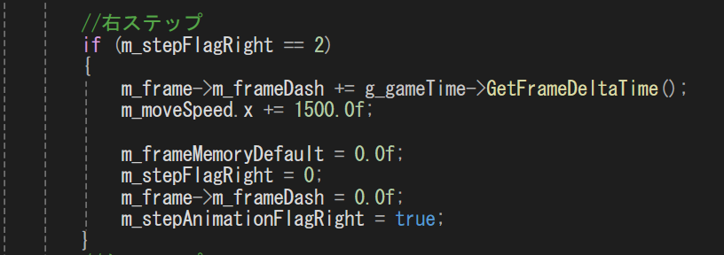 
> (図6.3) 右ステップ処理のコード 
>  
> 次に左スティックを離したときのコードは 
> さっき代入した保管用の変数を使って左スティックを右に倒していたフレームが10F(0.16秒)より短くて 
> 左スティックを離しているフレームが10F(0.16秒)経つまではステップフラグが立っています。(図6.2) 
> このフラグが立っているときに左スティックを右に倒したら右ステップすることができます。(図6.3) 
> 
> [目次へ戻る](#目次)

## 7.敵CPU
> 敵CPUは乱数で実装しました。 
> 移動とジャンプの処理を例に説明します。 
> 
> ### 距離
> 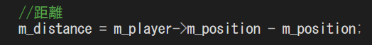 
> (図7.1) 距離を求めるコード 
>  
> 行動処理するためにまずは敵からプレイヤーまでの距離を求める。(図7.1) 
>  
> 
> ### 移動処理 
> 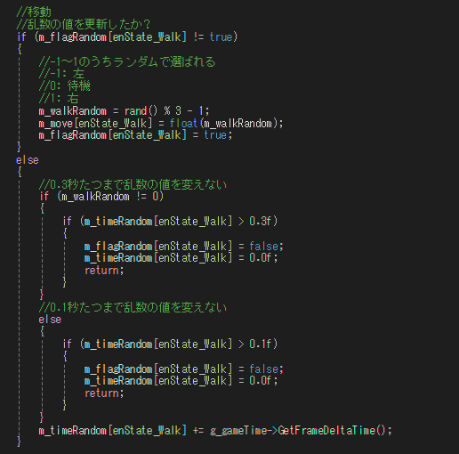 
> (図7.2) 移動処理のコード 
>  
> 移動処理は-1～1の範囲でランダムで値を出します。 
> 
> * -1が出たら左に移動する
> * 0が出たら立ち止まる
> * 1が出たら右に移動する 
> 
> 値を出したら乱数更新用フラグが立って時間が経つまで値を変えないようにする。 
> 時間が経過したらまたランダムで値を出せるようにする。(図7.2) 
>  
> 
> ### ジャンプ処理 
> 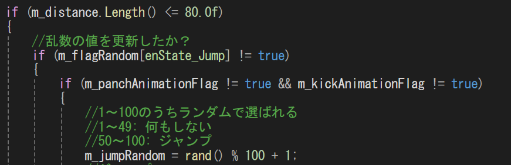 
> (図7.3) 乱数処理のコード 
>  
> 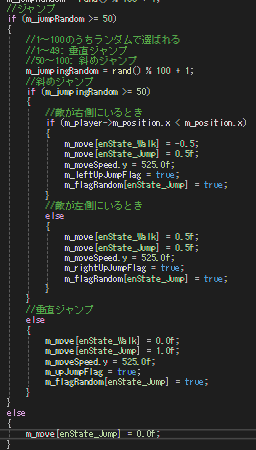 
> (図7.4) ジャンプ分岐処理のコード 
>  
> 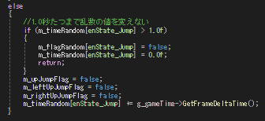 
> (図7.5) インターバル時間のコード 
>  
> 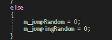 
> (図7.6) 乱数の値をリセットするコード 
>  
> 
> 一定の距離まで近づいていたらジャンプするための処理をします。 
> ジャンプ処理は1~100の範囲でランダムで値を出します。(図7.3) 
> 
> * 1～49が出たらジャンプしない。 
> * 50～100が出たらジャンプ分岐処理をする。 
> 
> 値が出たら次に斜めジャンプするかどうかの処理をします。 
> 処理はさっきと同じで1~100の範囲でランダムで値を出します。(図7.4) 
> * 1~49が出たら垂直ジャンプする。 
> * 50~100が出たらプレイヤーの位置によって左斜めジャンプか右斜めジャンプする。 
> 
> ジャンプしたら乱数の値をリセットします。(図7.6) 
> ジャンプし終わったらさっきの移動処理と同じで時間が経つまで値を変えないようにして 
> 時間が経過したらまたランダムで値を出せるようにする。(図7.5) 
> 一定の距離まで近づいていなかったら乱数の値をリセットしてジャンプ処理を行わない。(図7.6) 
>  
> 
> 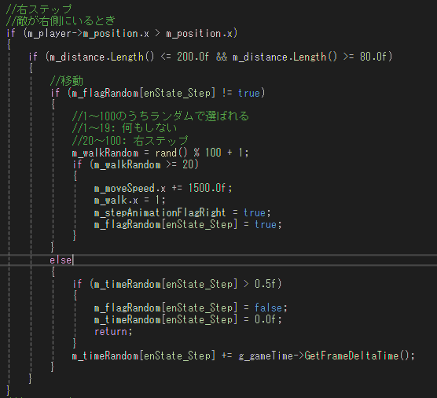 
> (図7.7) ステップ処理のコード 
>  
> 残りの行動はステップ・地上攻撃・空中攻撃でこの処理も移動・ジャンプ処理と同じ要領で処理していますが 
> ステップのみプレイヤーの位置によって左ステップか右ステップします。(図7.7) 
> 
> [目次へ戻る](#目次)

## 8.カメラ
> ### 初期位置と現在位置の取得
> 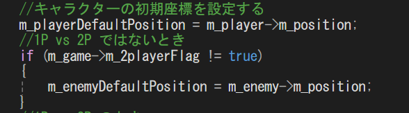 
> (図8.1) 初期位置を取得するコード 
>  
> 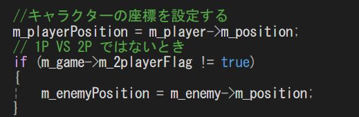 
> (図8.2) 現在位置を取得するコード 
>  
> 視点と注視点・画面端の処理で必要なので初期位置(図8.1)と現在位置(図8.2)を取得する 
>  
> 
> ### 注視点の処理
> 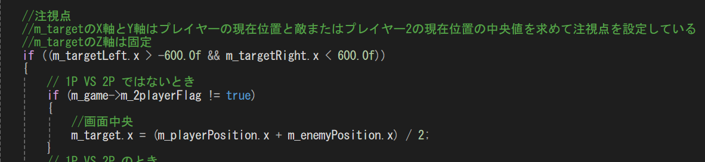 
> (図8.3) 注視点(x軸)の処理するコード 
>  
> 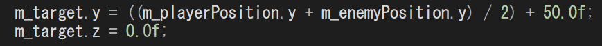 
> (図8.4) 注視点(y軸・z軸)の処理するコード 
>  
> 
> 注視点は以下の式で実装しました。 
> * x軸:(プレイヤーと敵(プレイヤー2)の合計) / 2 = 注視点 (図8.3) 
> * y軸: (プレイヤーと敵(プレイヤー2)の合計) / 2 + 50.0f = 注視点 (図8.4) 
> * z軸: 今回は動かさないので0.0fに固定 (図8.4) 
> 
> ### 画面端の処理
> #### キャラクター
> 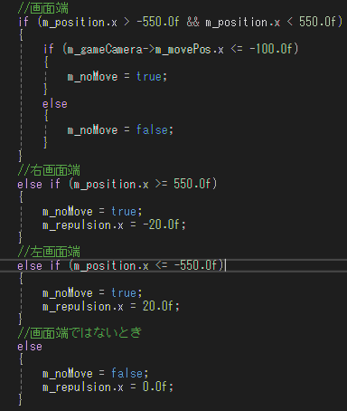 
> (図8.5) Player.cpp:画面端判定処理 
>  
> 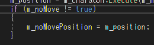 
> (図8.6) Player.cpp:画面端に行っていないとき 
>  
> 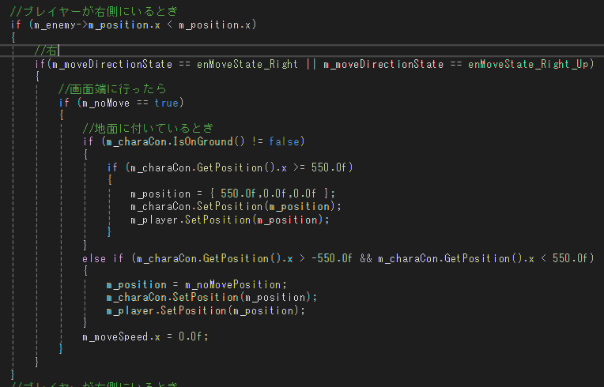 
> (図8.7) Player.cpp:画面端に行ったときの処理 
>  
> 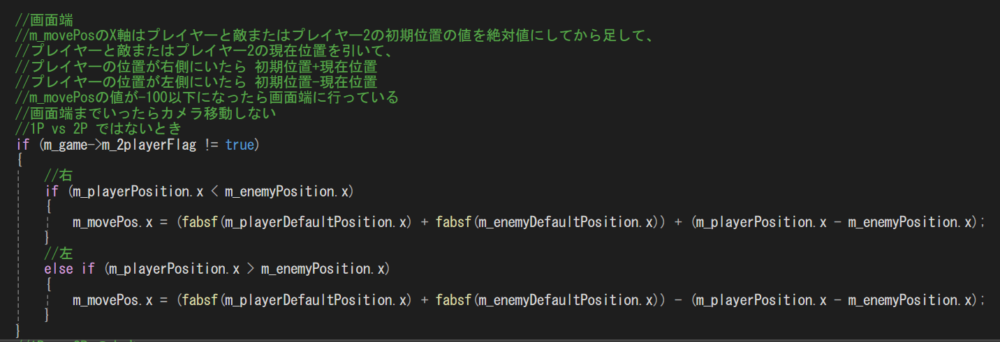 
> (図8.8) 画面端処理用のコード 
> * 画面端処理用の値を求める式
>   * 左側: ( |プレイヤーと敵(プレイヤー2)の初期位置の合計(x軸)| ) - ( プレイヤーと敵(プレイヤー2)の現在位置の差 ) 
>   * 右側: ( |プレイヤーと敵(プレイヤー2)の初期位置の合計(x軸)| ) + ( プレイヤーと敵(プレイヤー2)の現在位置の差 ) 
>  
> 
> このコードはプレイヤーが画面端に行ったときの処理が書かれているコードです。(図8.5) (図8.6) (図8.7) (図8.8) 
> 画面端に行く条件は2つあります。 
> * 左スティックを右または右上を倒した状態でGameCamera.cppのm_movePos.xの値が-100以下のとき (図8.8)
> * 左スティックを右または右上を倒した状態でプレイヤーの現在位置のx軸が-550.0fまたは550.0fに行ったとき
>
> この条件に当てはまったら画面端に行ったときの処理を行います。(図8.5) 
> 右画面端に行ったときを例に説明すると 
> 
> * 1つ目の条件に当てはまったらときは 
> 画面端に行っていないときに現在位置を画面端用の位置保管変数に更新し続けたものを 
> 現在位置を設定する関数にその変数を入れることでこれ以上右側に進まないようにすることができます。(図8.6) (図8.7) 
> 
> * 2つ目の条件に当てはまったときは 
> 右画面端の位置を現在位置を設定する関数に入れることでこれ以上右側に進まないようにすることができます。(図8.7) 
>  
> 
> #### カメラ
> 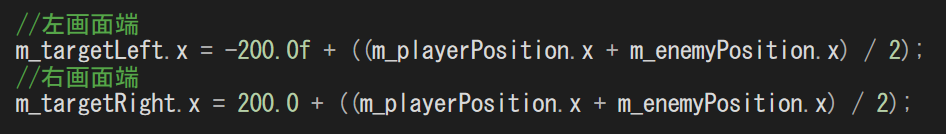 
> (図8.9) 画面端到達判定用のコード 
> * 画面端到達判定用の値を求める式
>   * 左側: -200.0f + (プレイヤーと敵(プレイヤー2)の合計) / 2 
>   * 右側: 200.0f + (プレイヤーと敵(プレイヤー2)の合計) / 2 
>  
> 
> 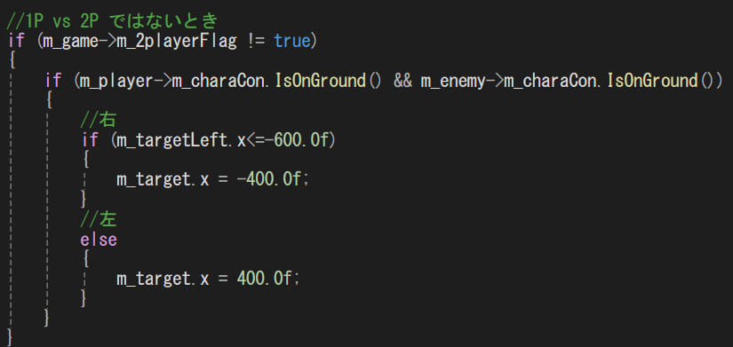
>  
> 画面端用に求めた値(図8.9)を使用してもし画面端に行ったら注視点(X軸)を固定する 
> 
> 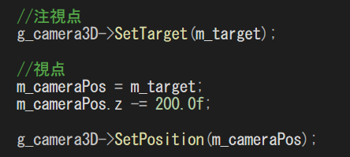
>  
> (図8.10)視点・注視点の設定 
> 
> [目次へ戻る](#目次)

## 9.制限時間のUI
> 学校内製ゲームエンジンにはテキストを表示する関数があります。 
> 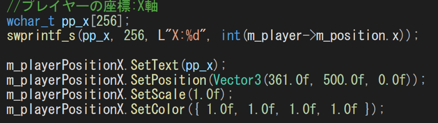 
> (図9.1) テキストを表示するコード 
>  
> これはデバッグ用に作ったコードです 
> このプログラムでUIを作らず簡単にテキスト表示することができます。(図9.1) 
>  
> 
>  
> (図9.2) 制限時間の数字のUI 
>  
> ですが今回制作したゲームのUIは大体は自分で作りました。 
> その中の制限時間の数字のUI(図9.2)も作りそれをさっき説明したテキストを簡単に表示するコードを 
> 使うことできないので以下のコードを実装することで制限時間の数字のUIを表示することに成功しました。 
> 
> 実装したコードについて説明します。 
> 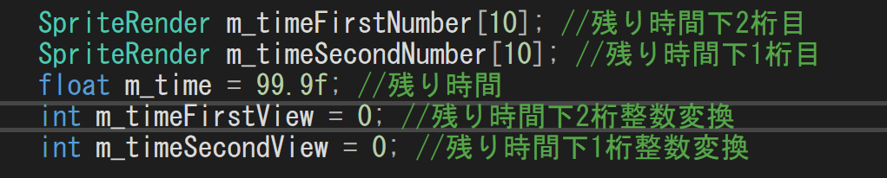 
> (図9.3) GameTimer.hのメンバ変数 
>  
> 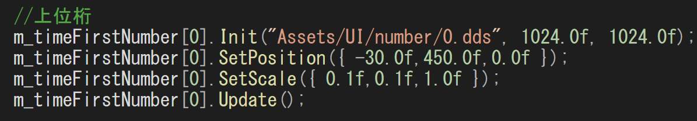 
> (図9.4) 制限時間の数字2桁目のUIの設定 
>  
> 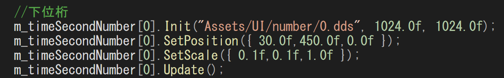 
> (図9.5) 制限時間の数字1桁目のUIの設定 
>  
> 制限時間の数字のUI表示するためにSpriteRender型というのを使います 
> SpriteRenderは画像を表示するために使います。 
> 今回はSpriteRenderの変数を配列にして2つ宣言します。(図9.3) 
>  
> 
> ### 制限時間の処理 
> 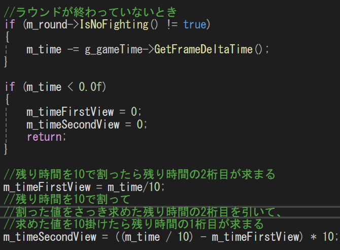 
> (図9.6) 制限時間の処理をするコード 
>  
> ラウンドが終わっていなかったら制限時間は進んでいきます。 
> 制限時間の数字1桁と2桁の求め方を説明していきます。(図9.6) 
> * 2桁目 
> 制限時間の値を10で割ることで制限時間の数字2桁目が求まることができます。 
> * 1桁目 
> 制限時間を10で割ってからさっき求めた2桁目の値を引いてから10を掛けると制限時間の1桁目が求まることができます。 
> 
> 整数値に変換するのは制限時間の数字を表示するための変数は配列にしています。 
> この配列の要素数(0~9)の値は整数値です。 
> さっき求めた1桁目と2桁目の値は実数値でこれを配列の要素数に適用して表示したいので整数値に変換する必要があります。 
>  
> 
> 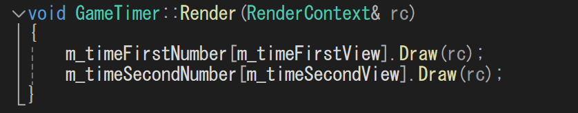 
> (図9.7) 制限時間の数字のUI描画 
> 
> [目次へ戻る](#目次)

## 10.KO時の演出
> 
>  
> 地上で攻撃を当てた場合 
> 
> 
>  
> 空中で攻撃を当てた場合 
> 
> ### 時が止まっている演出
> 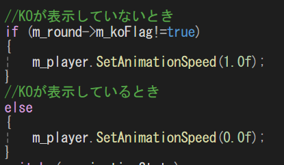 
> (図10.1) アニメーション再生速度 
>  
> KOが表示しているときに時を止まっているように見せるように 
> 各キャラクターのアニメーション再生速度を0.0fに設定すれば 
> 時が止まっているように見せることができる。(図10.1) 
>  
> 
> ### 空中で攻撃が当たった場合
> 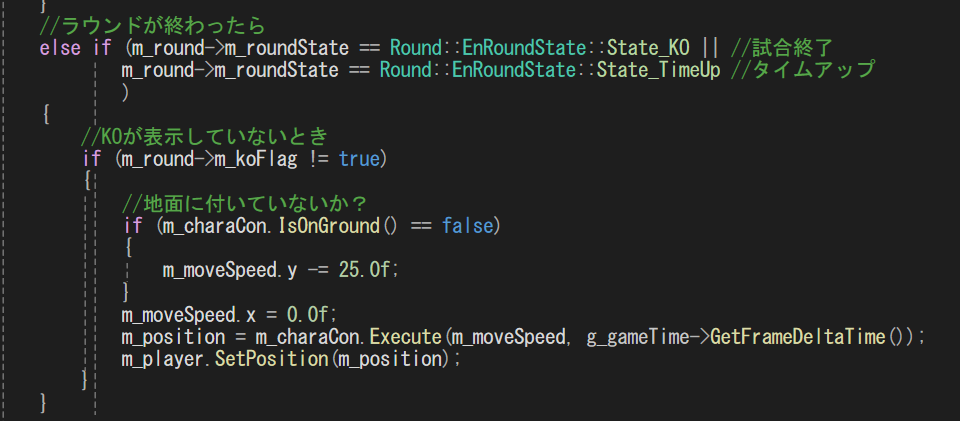 
> (図10.2) ラウンドが終わったときに空中にいたときのコード 
>  
> もしジャンプしているときに体力が0になったときはKOが表示している間は落下しないようにして 
> KOが表示しなくなったら落下するようにする。(図10.2) 
>  
> 
> ### 勝利アニメーションからフェードイン
> 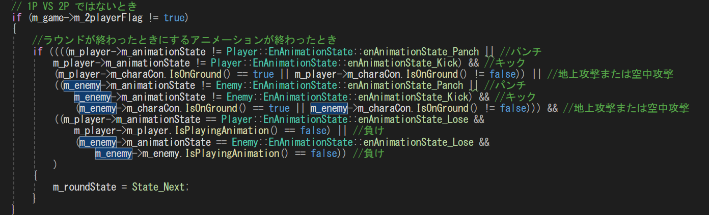 
> (図10.3) ラウンドが終わったときに攻撃・負けアニメーションが再生していないときのコード 
>  
> KOが表示しなくなったら勝った側は攻撃アニメーションを最後まで再生して 
> 負けた側は負けアニメーションを再生して 
> 負けアニメーションの再生が終わったら勝った側は勝利アニメーションを再生して 
> 再生が終わったら次のラウンドに行くためフェードアウトするか2ラウンド取得したらリザルト画面を表示する。(図10.3)  
> 
> [目次へ戻る](#目次)